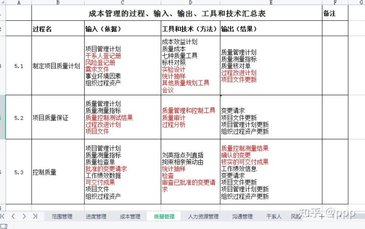

<!--
 * @Author: zhangniannian
 * @Date: 2022-03-29 18:15:19
 * @LastEditors: zhangniannian
 * @LastEditTime: 2022-03-29 18:26:11
 * @Description: 请填写简介
-->

# 1  

一、综合知识：【真题就是亲爹】  
上午综合知识部分是75道选择题，主要考察软件基础，包含一些计算机基础，如七层协议、防火墙、链路、安全等，一部分项目管理方面的知识，外加5分英语题，几道计算题。上午往往对通过考试起决定性作用，因为下午的案例题和论文都是有规律可循的，基本上突击一个多月，好好准备一下是没问题的，如果上午的综合知识平时模拟分数经常在40以下，那就需要着重学习下计算机基础和项目管理知识。因为它们占的比例比较大。  

二、案例分析：【得计算题者得天下】  
下午的案例分析一般是1道计算题，2道简答题。计算题一般会从挣值和单代号网络图中选一道。一般是不会考双代号网络图的，不太容易改卷，平时多做做计算题，并且要了解一下挣值的基本公式和网络图的画法。

三、论文：【十篇模板+结合实际+升华主题（俗称拍马屁）】  

下午最后一门论文，很多人觉得难，其实都是有套路模板的，平时多做准备，上考场就不会卡壳，论文包含摘要和正文两个部分，摘要一般在300字左右，提前根据自己的项目经验整理一份摘要，简单介绍下项目的背景、名称、投资规模、周期、参与方、建设内容等。这样的摘要基本上适用于所有的论文，而且阅卷老师其实没有时间看的太仔细的，就像高考阅卷老师一样，他们只会看一下摘要和结尾，以及你的字数是否符合规范。论文正文部分的话，根据论文题目，列出相关知识点，在论文中对这些知识点进行解析，并适当的添加一些案例来佐证用这些知识点如何管理好项目。

药方：  

1. 综合知识部分：反复做题、重复考点、训练记忆、贯穿始终
2. 案例部分：自己分析、手写答案、参考答题解析以及答题思路、总结答题技巧和规律  
3. 论文部分：准备300字摘要，准备每个领域的模板，准备几篇完整论文  

# 2  

## 1、对备考高项（信息系统项目管理师）做基本认知。  

考试要求：
（1）掌握信息系统知识；
（2）掌握信息系统项目管理知识和方法；
（3）掌握大型、复杂项目管理和多项目管理的知识和方法；
（4）掌握项目整体绩效评估方法；
（5）熟悉知识管理和战略管理；
（6）掌握常用项目管理工具；
（7）熟悉过程管理；
（8）熟悉业务流程管理知识；
（9）熟悉信息化知识和管理科学基础知识；
（10）熟悉信息系统工程监理知识；
（11）熟悉信息安全知识；
（12）熟悉信息系统有关法律法规、技术标准与规范；
（13）熟悉项目管理师职业道德要求；
（14）熟练阅读并准确理解相关领域的英文文献。

## 2、选择合适的培训班、选用合适的教材  

我是花了18块钱买的江山老师的培训课件  

## 3、细化学习计划、教材变薄又变厚，变厚又变薄  

### （1）综合部分  

按章节30-50页双面打印在一册，这里出行比较好携带，同时心理压力会变小，书变薄了。第一遍要速过，掌握概况。第二遍背诵+记忆。  

### （2）案例  

一定要用笔写出来、不要空、亲自算，再跟答案对照，偏差大的一定要用笔再写出来，而且不要让试卷是空的，有时候计算题不会，把公式写出来，阅卷老师也会给分的。  

### （3）论文  

如果做过信息化项目管理，找一个比较熟的系统或者平台照着老师发的论文模板写一遍；没做过项目经理，把自己日常用的比较熟的一套系统当成自己做过的项目；培训机构一般会预测方向，第一篇比较难写，但第一篇写完了，后面不管是范围还是进度，就是将项目管理5大过程组、10大知识领域、47个过程组进行展现，一般写个2-3篇也就够了。所以需要了解10大知识领域的输入输出和常用的工具技术。下面这张表最好自己做一遍，并且最好记住80%以上的内容。  

  

总之：论文只要结构规范、里面体现该知识领域对应的各个子过程不要漏，同时把输入输出及使用的工具技术体现，字数在2700、2800字左右，基本就能过了。下面以进度管理相关论文为例  

## 三、Tips  

1、首先要相信，自己一定足够努力，才可能过，没有随随便便的成功；高项的难度确实大，42天内，平均每天的学习时间在4个小时，周末、晚上，只要有的休息时间都尽量在看书做题，那段时间过的生不如狗，感谢家人的支持和理解。当时的感觉是如果当年高考能有这劲，说不定清华都能进了。  

2、要找到几个爱学习、志同道合的小伙伴们，大家互相监督，一起进步，遇到不懂的问题可以及时沟通交流；检验你沟通能力的时候也到了。如果大家报的培训机构不一样就更好了，到时候可以对照看预测题~~你懂的  

3、学会把教材看薄又看厚，老师最开始总结的教材，对照视频划重点记忆，等到最后的时候，也会有再精简的版本，但基本就是最开始用的那套教材你自己画出来的知识点和重点，尽量都记下来，实在不行混个眼熟。公式 要理解并且尽最大可能背下来-这是计算题的依据，计算题就算再难，没有高数难

4、要利用碎片化的时间，着重理解不懂的知识点，比如当时我会利用开车的时间在喜马拉雅或者抖音上听不懂的知识点，比如质量保证和质量控制、比如沟通里面的拉式和推式，知识点要吃透，不透的不要太多

5、平时测试案例和综合要在50分以上，除了学习外，一定要做题，因为高项考试知识点实在比较多，做题是检验学习效果的重要标尺。

6、案例题不要空，关联的都可以往上写，计算题实在不会可以写公式，把基本PV，EV算出来都可能给分的，不要空，不要空

7、考前一周、一天、一个小时非常非常重要，各大培养机构的重点、预测题都会出来，可以找小伙伴们交流共享，很有用的，案例一定要多做题，一定要会了。

8、一定要休息好，考试当天的中午，我去考点附近找了个按脚的，中间小憩了一会，休息好了，吃饱了下午才有力气，因为早上考2:30小时的综合，还不能提前交卷，下午的案例和论文是连在一起考3个半小时，考完，人都要废了。

